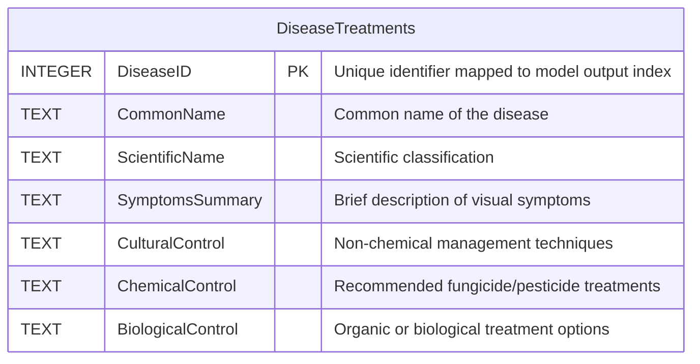

# Crop Disease Identifier from Leaf Image

## Instant, offline crop disease diagnosis and severity estimation using on-device AI for farmers without internet access.
---

## 1. Problem Statement

### Problem Title
#### Crop Disease Identifier from Leaf Images

### Problem Description
Crop diseases cause significant reductions in agricultural productivity and farmer income. While early detection is critical to preventing large-scale damage, farmers currently lack accessible, offline, and real-time diagnostic tools. This project aims to build an on-device, camera-based machine learning system that operates fully offline to identify crop diseases from leaf photographs, estimate severity levels, and provide actionable treatment recommendations directly at the point of need.

### Target Users
Farmers and agricultural workers, particularly those in rural or low-connectivity regions who lack immediate access to expert agricultural consultation or reliable internet.

### Existing Gaps
* **Reliance on Manual Methods:** Farmers currently depend on guesswork, manual inspection, or delayed expert consultation, allowing diseases to spread before intervention.
* **Internet Dependency:** Existing digital diagnostic solutions often require active internet connectivity, rendering them unusable in remote agricultural areas.
* **Lack of Comprehensive Offline Tools:** There is a shortage of tools that combine disease classification, severity estimation, and a locally stored agricultural knowledge base into a single, offline application.
* **Economic Vulnerability:** Delayed diagnoses lead to decreased crop yields, increased input costs for late treatments, and reduced income stability for farmers.

---

## 2. Problem Understanding & Approach

**Root Cause Analysis**
The main technical hurdle in agricultural AI is the clash between computational complexity and real-world connectivity. High-accuracy models typically require powerful cloud servers, rendering them useless in rural, offline environments running on standard consumer hardware. 

**Solution Strategy**
Our approach solves this by bringing cloud-level processing directly to the user's device. We train state-of-the-art deep learning models (specifically Swin Transformers and CNNs) in PyTorch, and then convert their computation graphs into the highly optimized ONNX format. By embedding these lightweight models inside an Electron desktop app, we can tap directly into the user's local hardware (GPU/NPU) for acceleration. This allows us to run fast, highly accurate inference entirely offline, bypassing the need for an internet connection.

---
### 3. Proposed Solution

### Solution Overview
An Electron-based desktop application providing an automated, offline pipeline for plant disease diagnosis.

**Key Features**
* **100% Offline Operation:** All disease diagnosis, severity calculation, and treatment lookups happen entirely on the user's local hardware.
* **SOTA AI Classification:** Leverages the global context understanding of Transformers (like Swin Transformer V2) for highly accurate disease identification.
* **User-Guided Filtering:** Users select the crop species first, narrowing the AI's focus to ensure highly specialized and accurate results.
* **Damage Severity Assessment:** Uses pixel-precise semantic segmentation to calculate the exact percentage of diseased versus healthy tissue on the leaf.
* **Pre-Inference Quality Control:** Automatically detects and rejects blurry images (using Laplacian variance) before they hit the model, saving compute power and preventing false diagnoses.
* **Test-Time Augmentation (TTA):** The system slightly alters the input image (flips, rotations) on the fly and averages the predictions to guarantee a stable, highly confident result.
* **Embedded Treatment Database:** A local SQLite database instantly provides symptom breakdowns and actionable treatment strategies (cultural, chemical, and biological).

---

## 4. System Architecture

### High-Level Flow

User $\rightarrow$ Frontend GUI (React) $\rightarrow$ Image Pre-filtering (Laplacian Variance Check in Main Process) $\rightarrow$ AI Models (Local ONNX Runtime Engine) $\rightarrow$ Model Aggregation (Classification + Severity %) $\rightarrow$ Database Lookup (SQLite) $\rightarrow$ Formatted Response on UI.

### Architecture Description

The application uses an Electron-based architecture that cleanly separates the responsive user interface (Frontend Renderer process) from the intense computational load and hardware binding (Backend Main process).

### Architecture Diagram

---

## 5. Database Design

### ER Diagram

### ER Diagram Description
The application utilizes a localized SQLite database with a central DiseaseTreatments entity. This table maps unique disease identifiers (corresponding to the model's output index) to detailed diagnostic metadata and prevention strategies.

---

## 6. Dataset Selected

### Dataset Name
PlantVillage Dataset 

### Source
Kaggle: [emmarex/plantdisease](https://www.kaggle.com/datasets/emmarex/plantdisease)

### Data Type
Thousands of RGB leaf images categorized into 15 classes. It covers both healthy and diseased leaves (like Early Blight and Bacterial Spot) for three main crops: tomatoes, potatoes, and bell peppers.

### Selection Reason
We chose this PlantVillage Dataset because it's an free access kaggle dataset of 54,306 images of healthy and diseased plant leaves, collected to advance research in automated plant disease diagnosis. It covers 14 crop species and 26 diseases, making it one of the largest publicly available datasets for computer vision in agriculture.. It gives us a clean, expertly labeled, and balanced set of images for high-impact crops, making it perfect for training a reliable, real-world model to help farmers.

### Preprocessing Steps

---

## 7. Model Selected

### Model Name 
- Swin Transformer V2 (Classification Backbone)
- U-Net w/ EfficientNet-B0 (Segmentation Decoder)

### Selection Reasoning
Swin V2 utilizes shifted-window self-attention, construct hierarchically a profound global understanding of the visual space, critical for identifying systemic disease patterns that local convolutions miss.
U-Net w/ EfficientNet-B0 provides precise spatial localization and high-resolution spatial contouring, critical for accurate pixel-wise severity calculation.

### Alternatives Considered
- MobileNetV3 (Inaccurate on current hardware budget)
- ConvNeXt (Lower performance on global disease patterns)

### Evaluation Metrics
Classification: Top-1 Accuracy, Macro-F1 Score.
Segmentation: Mean Intersection over Union (mIoU), Dice Coefficient.

---

## 8. Technology Stack

### Frontend: React,Typescript
### Backend: Nodejs,Express
### ML/AI: Tensorflow
### Database: SQLite
### Deployment: Electron

---

## 9. API Documentation & Testing

### API Endpoints List
- Endpoint 1:
- Endpoint 2:
- Endpoint 3:

### API Testing Screenshots
(Add Postman / Thunder Client screenshots here)

---

## 10. Module-wise Development & Deliverables

### Checkpoint 1: Research & Planning
- Deliverables: Finalized dataset manifest, training/validation splits, model configurations.

### Checkpoint 2: Backend Development
- Deliverables: Two finalized, serialized, high-accuracy ONNX models: Classification (Swin V2) and Segmentation (U-Net).

### Checkpoint 3: Frontend Development
- Deliverables: Functioning Electron Main Process structure, optimized SQLite database integration via better-sqlite3 with populated treatment data.

### Checkpoint 4: Model Training
- Deliverables: Implementation of the ONNX Inference pipeline within Node.js, blur-detection filter, and pre-inference tensor preprocessing.

### Checkpoint 5: Model Integration
- Deliverables: Complete React-based GUI, intuitive plant selection flow, diagnostic report display, and real-time inference monitoring.

### Checkpoint 6: Deployment
- Deliverables: Final cross-platform application installers (e.g., .exe, .dmg, .AppImage)

---

## 11. End-to-End Workflow

1. Farmer launches the application on a desktop computer.
2. On the home screen, they are prompted to select their plant type (e.g., Tomato)..
3. The farmer captures or uploads a leaf photograph.
4. The backend main process immediately converts the image and runs the blur-detection filter. If the image is blurry, it is immediately rejected, and the user is prompted to retake it..
5. If passed, the image tensor is routed through the Swin Transformer V2 model for high-accuracy disease identification.
6. Simultaneously, the image is passed to the U-Net model to create a diseased pixel mask.
7. The main process averages model predictions (via TTA) for classification stability and calculates the exact severity percentage.
8. The main process queries the local SQLite database for symptoms, symptoms summary, and control strategies.
9. The finalized, structured report, combining the diagnosis, severity estimate, and actionable treatment steps, is rendered to the farmer's screen.
10. The farmer can then save the diagnosis locally or export it as a PDF for future reference.

---

## 12. Demo & Video

- Live Demo Link:
- Demo Video Link:
- GitHub Repository: https://github.com/Vegapunk-debug/crop-disease-identifier

---

## 13. Hackathon Deliverables Summary

A fully operational, offline-first desktop application using a sophisticated, cascaded ONNX inference pipeline (Transformer + Segmentation) for agricultural diagnostics.

---

## 14. Team Roles & Responsibilities

| Member Name | Role | Responsibilities |
|-------------|------|-----------------|
Rohit Nair P | Project Lead / Backend
Angelo Nelson | ML Lead / Training
Nandan S Acharya | Frontend Lead / DataBase

---

## 15. Future Scope & Scalability

**Short-Term Goals**
* **Multilingual Support:** Adding regional language options to the interface and treatment database so a wider demographic of farmers can easily use the app.
* **Dedicated Mobile App:** Porting the project to a dedicated mobile app using React Native (with Expo) to run the ML models natively on-device for an even smoother offline experience. 

**Long-Term Goals**
* **Explainable AI (Grad-CAM):** Showing farmers exactly *where* the model sees the disease on the leaf by generating visual heatmaps . This transparency helps build real trust in the AI's diagnosis.
* **Low-Bandwidth Syncing:** Setting up the app to fetch tiny, background updates for the disease database whenever the phone briefly catches an internet connection, ensuring the local knowledge base stays current without needing a heavy download.

---

## 16. Known Limitations

* **Dataset Constraints:** The model's real-world accuracy is strictly bound by the quality and class balance of the PlantVillage training dataset. It currently only recognizes the specific crops and diseases it was explicitly trained on.
* **Lack of Anomaly Detection:** The system currently lacks out-of-distribution (OOD) detection. This means if the camera is pointed at an unsupported plant species, a non-leaf object, or a completely new disease, the model will still attempt to force a classification into one of its known categories rather than flagging it as "Unknown."

---

## 17. Impact

This system eliminates the internet connection bottleneck in remote agricultural areas, giving farmers direct access to high-accuracy diagnostic tools. By delivering cloud-level AI performance completely offline, farmers can make immediate, precise treatment decisions. This rapid intervention helps reduce unnecessary chemical costs, stabilizes crop yields, and ultimately increases their overall economic resilience.