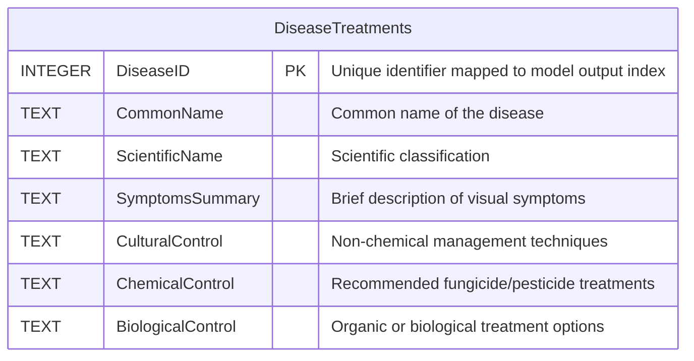

# Crop Disease Identifier from Leaf Image

Instant, offline crop disease diagnosis and severity estimation using on-device AI for farmers without internet access.

---

## 1. Problem Statement

### Problem Title
## Crop Disease Identifier from Leaf Images

### Problem Description
Crop diseases cause significant reductions in agricultural productivity and farmer income. While early detection is critical to preventing large-scale damage, farmers currently lack accessible, offline, and real-time diagnostic tools. This project aims to build an on-device, camera-based machine learning system that operates fully offline to identify crop diseases from leaf photographs, estimate severity levels, and provide actionable treatment recommendations directly at the point of need.

### Target Users
Farmers and agricultural workers, particularly those in rural or low-connectivity regions who lack immediate access to expert agricultural consultation or reliable internet.

### Existing Gaps
* **Reliance on Manual Methods:** Farmers currently depend on guesswork, manual inspection, or delayed expert consultation, allowing diseases to spread before intervention.
* **Internet Dependency:** Existing digital diagnostic solutions often require active internet connectivity, rendering them unusable in remote agricultural areas.
* **Lack of Comprehensive Offline Tools:** There is a shortage of tools that combine disease classification, severity estimation, and a locally stored agricultural knowledge base into a single, offline application.
* **Economic Vulnerability:** Delayed diagnoses lead to decreased crop yields, increased input costs for late treatments, and reduced income stability for farmers.

---

## 2. Problem Understanding & Approach

### Root Cause Analysis
### Solution Strategy

---

## 3. Proposed Solution

### Solution Overview
An Electron-based desktop application providing an automated, offline pipeline for plant disease diagnosis.

### Core Idea

### Key Features

---

## 4. System Architecture

### High-Level Flow
User $\rightarrow$ Frontend GUI (React) $\rightarrow$ Image Pre-filtering (Laplacian Variance Check in Main Process) $\rightarrow$ AI Models (Local ONNX Runtime Engine) $\rightarrow$ Model Aggregation (Classification + Severity %) $\rightarrow$ Database Lookup (SQLite) $\rightarrow$ Formatted Response on UI.

### Architecture Description
The application uses an Electron-based architecture that cleanly separates the responsive user interface (Frontend Renderer process) from the intense computational load and hardware binding (Backend Main process).

### Architecture Diagram
(Add system architecture diagram image here)

---

## 5. Database Design

### ER Diagram

### ER Diagram Description

---

## 6. Dataset Selected

### Dataset Name
PlantVillage Dataset 

### Source
Kaggle: [emmarex/plantdisease](https://www.kaggle.com/datasets/emmarex/plantdisease)

### Data Type
Thousands of RGB leaf images categorized into 15 classes. It covers both healthy and diseased leaves (like Early Blight and Bacterial Spot) for three main crops: tomatoes, potatoes, and bell peppers.

### Selection Reason
We chose this PlantVillage Dataset because it's an free access kaggle dataset of 54,306 images of healthy and diseased plant leaves, collected to advance research in automated plant disease diagnosis. It covers 14 crop species and 26 diseases, making it one of the largest publicly available datasets for computer vision in agriculture.. It gives us a clean, expertly labeled, and balanced set of images for high-impact crops, making it perfect for training a reliable, real-world model to help farmers.

### Preprocessing Steps

---

## 7. Model Selected

### Model Name
### Selection Reasoning
### Alternatives Considered
### Evaluation Metrics

---

## 8. Technology Stack

### Frontend: React,Typescript
### Backend: Nodejs,Express
### ML/AI: Tensorflow
### Database: SQLite
### Deployment: Electron

---

## 9. API Documentation & Testing

### API Endpoints List
- Endpoint 1:
- Endpoint 2:
- Endpoint 3:

### API Testing Screenshots
(Add Postman / Thunder Client screenshots here)

---

## 10. Module-wise Development & Deliverables

### Checkpoint 1: Research & Planning
- Deliverables:

### Checkpoint 2: Backend Development
- Deliverables:

### Checkpoint 3: Frontend Development
- Deliverables:

### Checkpoint 4: Model Training
- Deliverables:

### Checkpoint 5: Model Integration
- Deliverables:

### Checkpoint 6: Deployment
- Deliverables:

---

## 11. End-to-End Workflow

1.
2.
3.
4.
5.
6.
7.

---

## 12. Demo & Video

- Live Demo Link:
- Demo Video Link:
- GitHub Repository: https://github.com/Vegapunk-debug/crop-disease-identifier

---

## 13. Hackathon Deliverables Summary

-
-
-
-

---

## 14. Team Roles & Responsibilities

| Member Name | Role | Responsibilities |
|-------------|------|-----------------|
Rohit Nair P
Angelo Nelson
Nandan S Acharya

---

## 15. Future Scope & Scalability

**Short-Term Goals**
* **Multilingual Support:** Adding regional language options to the interface and treatment database so a wider demographic of farmers can easily use the app.
* **Dedicated Mobile App:** Porting the project to a dedicated mobile app using React Native (with Expo) to run the ML models natively on-device for an even smoother offline experience. 

**Long-Term Goals**
* **Explainable AI (Grad-CAM):** Showing farmers exactly *where* the model sees the disease on the leaf by generating visual heatmaps . This transparency helps build real trust in the AI's diagnosis.
* **Low-Bandwidth Syncing:** Setting up the app to fetch tiny, background updates for the disease database whenever the phone briefly catches an internet connection, ensuring the local knowledge base stays current without needing a heavy download.

---

## 16. Known Limitations

-
-
-

---

## 17. Impact

-
-
-
